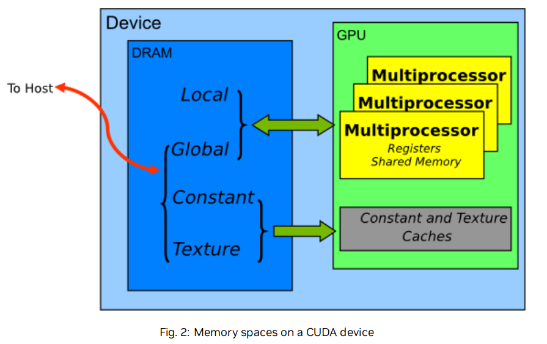

# Chapter 12 性能度量 Performance Metrics

## 12.1 计时器
在对CUDA程序计时时，使用CPU或者GPU的计时器都是可以的，下面是对这两种计时方法的分析：
### 12.1.1 使用CPU计时器

使用传统的基于CPU的计时器比如<chrono>等，但是在GPU上函数的执行是异步的，所以为了精确地测量调用CUDA函数的耗时，需要在启动和停止计时器时先试用cudaDeviceSynchronize()强制对CPU和GPU进行同步，cudaDeviceSynchronize()将调用的CPU线程堵塞，直到完成所有CUDA的操作。
虽然在GPU上也可以将CPU线程与特定的流或事件进行同步，但是这些同步函数并不适用于默认流以外的流中的计时器，cudaStreamSynchronize ( )将CPU线程阻塞，直到之前发送到给定流中的所有CUDA调用都完成。cudaEventSynchronize ( )阻塞，直到特定流中的给定事件被GPU记录。由于驱动程序可能会交织执行来自其他非默认流的CUDA调用，因此可能会将其他流中的调用包含在计时中。但是默认流Stream0在device上工作表现出串行性，所以可以直接使用这些函数进行计时。
最后需要注意一点的是，CPU和GPU的同步操作会强制阻塞，所以会最大限度的降低性能。
### 12.1.2 使用GPU计时器

```cpp
cudaEvent_t start, stop; 
float time; 
cudaEventCreate(&start); 
cudaEventCreate(&stop); 
cudaEventRecord( start, 0 );  // 这里的0是指 Stream0，也就是默认流
kernel<<<grid,threads>>> ( d_odata, d_idata, size_x, size_y, NUM_REPS); 
cudaEventRecord( stop, 0 );  // 同样这里也是
cudaEventSynchronize( stop ); 
cudaEventElapsedTime( &time, start, stop ); 
cudaEventDestroy( start ); 
cudaEventDestroy( stop );

```
使用cudaEventRecord将start 和 stop这两个事件放入到Stream0中，当事件到达Stream0时，会记录时间戳，使用cudaEventSynchronize对CPU和GPU进行同步，然后使用cudaEventElapsedTime进行计时。这种计时时使用GPU时钟进行计时的，

## 12.2 带宽 (Band Width) **Hight Priority**

带宽衡量数据的传输速率，在性能优化中是很重要的一环，为了准确测量性能，需要计算理论带宽和有效带宽。当后者远低于前者时，设计或实现细节都有可能降低带宽，提高带宽应该是后续优化工作的首要目标。

### 12.2.1 理论带宽计算

可以根据显卡的硬件规格参数进行计算。
例如，NVIDIA Tesla V100采用HBM2 (双倍数据率) RAM，其存储时钟速率为877 MHz，具有4096位宽的存储器接口。
$$(0.877 \times 10^9 \times 4096/8 \times 2) \div 10^9 = 898GB/s$$
### 12.2.2 有效带宽计算

有效带宽用于了解在程序运行过程中数据数如何访问的，下面是计算公式
$$Effective Band Width = ((Byte_{read} + Byte_{write}) \div 10^9) \div times$$
(通常使用GB/s作为单位)
这里Byte_read 和Byte_wirte分别是在kernel中读取和写入的字节数。
例如，计算一个对$2048 \times 2048$的矩阵进行拷贝的操作的带宽：
$$((2048 ^ 2 \div 4 \times 2) \div 10^9) \div time$$
这里的4是float类型的字节，2是包含了读写两次操作。

### 12.2.3 Visual Profiler
使用Visual Profiler可以查看一下几个吞吐量指标：
- Requested Global Load Throughput  
- Requested Global Store Throughput
- Global Load Throughput 
- Global Store Throughput 
- DRAM Read Throughput 
- DRAM Write Throughput

其中 Requested Global Load Throughput 和 Request Global Store Throughput表示的是kernel中的全局内存吞吐量，用于计算Effective Band Width有用。
而在程序运行过程中整体的吞吐量还会计算一些不会使用的数据传输，也就是Global Load Throughput 和 Global Load Throughput。
这两者的比较可以有效的看出Global Memory被浪费了多少资源，对于Global Memory访问，这种请求的内存带宽与实际的内存带宽的比较是通过Global Memory Load Efficiency和Global Memory Store Efficiency的度量来报告的。


# Chapter13 内存优化 Memory Optimizations 

内存优化是性能优化中最重要的领域。其目标是通过最大化带宽来最大化硬件的使用。带宽是通过使用尽可能多的快速存储器和尽可能少的慢速存储器来实现的。本章讨论了主机和设备上的各种内存，以及如何更好地设置数据项来有效地使用内存。

## 13.1 Host的Device的数据传输

关于Host和Device的数据传输，看看这篇blog，感觉很不错[Nvidia Blog](herf=https://developer.nvidia.com/blog/how-optimize-data-transfers-cuda-cc/)。

首先，device memory和GPU之间的带宽（上文中提到的V100 898GB/s）远高于host memory和device memory之间的带宽（16GB/s  pcie x16 Gen3）。

### 13.1.1 Pinned Memory (锁页内存)

一般情况下GPU不能直接访问主机内存中的数据，在进行数据传输的时候，需要先在主机上分配一个临时的page-locked memory(pinned memory)， 然后将主机的数据copy到这块区域内，然后再将这块区域内的数据transfer到设备上。


如上图所示，在左图中，发生了两次拷贝，我们可以完全避免这次拷贝，然后直接使用cudaHostAlloc() / cudaMallocHost() 直接申请这片pinned memory并避免了一次拷贝。在进行数据传输的时候，仍然可以使用cudaMemcpy()进行数据拷贝。
合理使用pinned memory可以有效的提高数据传输的带宽，但是过度的使用，会造成性能的下降，因为它减少了操作系统和其他程序的内存可使用量。

### 13.1.2 通过Stream来并发数据传输

#### 13.1.2.1 并发Device数据传输和Host计算
在使用cudaMemcpy()的时候，会强制进行阻塞，也就是说，当数据传输完成后才会将控制权返回给主机，而cudaMemcpyAsync()是非阻塞的，控制权立即返回给主机，在调用时额外多了一个参数 stream id。流就是在gpu执行的所有操作的载体，包括数据传输、kernel等。

```cpp
// Overlapping computation and data transfers
cudaMemcpyAsync(a_d, a_h, size, cudaMemcpyHostToDevice, 0); //异步传输数据，并且不阻塞主机， by stream0
kernel<<<grid, block>>>(a_d); // 启动kernel by default stream 0
cpuFunction();                // 执行主机计算
```

这里使用的是都是stream 0同一个流，在流内部保证操作按顺序进行， 所以这里会在数据拷贝完成后进行kernel中的计算，不需要显示的进行同步。通过这个例子可以将数据传输和主机的计算并行起来。
#### 13.1.2.1 并发Device数据拷贝和Device kernel execute

在上面的例子中拷贝数据和启动kernel本身就是需要顺序去执行的，同时还可以并行数据传输和kernel的执行，这种特性可以通过cudaDeviceProp().asynEngineCount来查询。通过设置不同的stream id就可以让数据传输和kernel的执行并发的去执行，但是这里需要**注意**的一点是，此时，这里不能使用default stream(Stream 0)，由于默认流本身具有一定的特性：在设备上其他流的工作没完成之前，默认流的工作不会开始，同时默认流的工作没结束之前，其他新的流的工作也不能开始。

通过这种特性，就可以将一些大块的、可进行划分的数据划分为几个部分，然后分开去进行数据传输和kernel的执行，达到并发的效果。


```cpp
size=N*sizeof(float)∕nStreams; 
for (i=0; i<nStreams; i++) { 
    offset = i*N∕nStreams; cudaMemcpyAsync(a_d+offset, a_h+offset, size, dir, stream[i]); 
    kernel<<<N∕(nThreads*nStreams), nThreads, 0, stream[i]>>>(a_d+offset); 
}
```


以上是overlapping之后的效果。

### 13.1.3 零拷贝 (Zero copy)

Zero copy使得GPU可以直接访问主机的内存，

```cpp
float *a_h, *a_map; 
... 
cudaGetDeviceProperties(&prop, 0); 
if (!prop.canMapHostMemory) 
    exit(0); 
cudaSetDeviceFlags(cudaDeviceMapHost); 
cudaHostAlloc(&a_h, nBytes, cudaHostAllocMapped); cudaHostGetDevicePointer(&a_map, a_h, 0); 
kernel<<<gridSize, blockSize>>>(a_map);

```
零拷贝避免了使用stream进行传输，GPU在运行时，直接访问的是主机中的内存区域。

### 13.1.4 Unified Virtual Address(UVA) 统一虚拟寻址
主机和设备可以共享同一个虚拟地址。


### 讨论： 关于使用pinned memory,not mapped (页锁内存)和mapped，pinned memory(Zero copy)的情况区别：

 [stackoverflow上的讨论](https://stackoverflow.com/questions/5209214/default-pinned-memory-vs-zero-copy-memory)
简单概括下高赞回答：
- Zero copy：
  - GPU本身没有内存了，只能使用RAM。
  - 只加载一次数据，但是需要对其执行大量的计算，并且隐藏内存传输延迟。
  - 数据并不适合GPU。
- pinned memory：
  - 当您多次加载或存储数据时。例如：您有多个后续内核，分步执行工作 - 无需每次都从主机加载数据。
  - 没有太多的计算需要执行，并且加载延迟不会被很好地隐藏

## 13.2 Device Memory 设备内存

设备内存中有不同的部分，每一部分都为了特定的功能而设计的。



不同的内存访问延迟：Global > local > texture > constant > shared > register 

### 13.2.1 针对Global Memory访问的合并优化

在Global Memory上的加载和访问操作会被设备优化成为事务，简单来说就是可以将一个block中的一个warp内的一些连续的多个访存操作进行合并，成为一个请求，然后进行内存的访问，从而优化带宽。

这里有一个关于Memory Coalescing的讨论[stackoverflow连接](https://stackoverflow.com/questions/5041328/in-cuda-what-is-memory-coalescing-and-how-is-it-achieved)

#### 13.2.1.1 简单的合并访存的例子

在compute capability 6.0及以上的设备上，一个warp内的所有访问内存在操作都被合并为32byte-transaction。


假设目前有个block内的线程要访问一个4-byte的数据，此时就会发生memory coalescing，在block内线程是被划分进warp中进行执行的（一般一个warp内32个threads），那么这个warp内就有32 * 4这么多的访问需要，如果不进行合并，那么要进行32次访问操作，但是是经过32byte-transaction合并后，只进行4次访问操作（如上图）。

#### 13.2.1.2 连续但访问未对齐

如果说warp内的访问的内存区域是连续的，但是并不是和32-byte对齐的话，那么就会进行5次 32byte-transaction操作。可能是访问的区域有offset，然后导致和32byte并不对齐，然后就会多取一个区域。


#### 13.2.1.3 访问未对齐的结果

如果访问未对齐，那么会如上图一样多发生一次32byte-transaction，就会造成额外的访问操作，导致有效带宽下降。

```cpp
__global__ void offsetCopy(float *odata, float* idata, int offset) {
	int xid = blockIdx.x * blockDim.x + threadIdx.x + offset; //注意这里的offset，就是导致访问未对齐的原因。
    odata[xid] = idata[xid]; 
}
```

当offset为0或者为8（$4 \times 8 = 32byte$）的倍数时，会发生4次32byte-transaction，当为其他的时候就会发生5次，所以理论上来说有效带宽会变为之前的80%，但是在实验中因为相邻的warp之间会保留cache，所以有效带宽变为了原来的90%，但是足以说明问题。

TODO： add code example and result

#### 13.2.1.4 strides access 按步访问

按步幅访问内存在一些矩阵操作中经常会碰到，而这种访问方式会极大的降低有效带宽，假设步幅为2，那么按照之前的合并策略相邻的线程会公用同一个32-byte-transactions，而其中一般的数据都是无用的，所以会浪费掉。同时随着步幅的增大，这种情况会更严重，最极端的情况下会导致一个warp中的32个线程都开启一个32-byte-transaction。


### 13.2.2 L2 Cache

从CUDA 11.0开始 compute capability 8.0以上的设备支持了L2 Cache，这是一种支持高速访问的缓存。

#### 13.2.2.1 L2 Cache 访问窗口

在global memory的访问过程中可能会出现一些数据被频繁的访问，那么可以认为这块区域是持久访问区域(persisting access)，而其他的责备认为是流式访问，为了提高访问效率L2 Cache区域用于存储这些数据，如果说没有数据存储在L2 Cache中，则一般的流式访问的数据也可以存储在这篇区域内。

```cpp

```

需要注意的是需要根据num_bytes和L2 缓存的大小来调整hitRatio来避免L2 Cache抖动。

#### 13.2.2.2 调整访问窗口的命中率

hitRatio描述的是在全局内存区域中，申请的L2 Cache这片区域内，即：[ptr + num_bytes]的 hitRatio * 100%的数据是具有持久访问的性质，剩下（1 - hitRatio）* 100%的数据仍然是流式访问。


但是GPU中的L2 Cache的大小是固定的，如Tesla V100的L2 Cache是40MB，当hitRatio为1.0时，当L2的num_bytes设置的太大，就会导致L2 Cache中的数据被频繁的换入换出，也就是操作系统中的抖动（trashing），可以看到当L2 Cache大于30MB时，性能就会发生下降，如下图。


但是我们可以通过调整合适的hitRatio来适当的避免trashing的情况。


### 13.2.3 Shared Memory 共享内存

共享内存也是GPU上的一片区域，每个block都有一片这样的区域，block中的thread可以共享这片区域。相比于global memory，在没有线程冲突的情况下拥有更高的带宽和更低的延迟。

在申请使用共享内存的时候有两种方式：静态共享内存和动态共享内存。
静态共享内存可以在kernel中直接通过
```cpp
__shared__ float shared_A[SIZE]; // 这里SIZE必须是静态常量，不能是运行时确定的值。
```
动态共享内存需要现在kernel中声明一下：
```cpp
extern __shared_ float shared_A[]； //这里可以暂时不指定SIZE，在kernel启动的时候传入size大小

///// 如下
kernel<<<grid_size, block_size, NS, stream_t>>> //这里的NS是除过kernel中的静态贡献内存额外指定的一个动态共享内存的大小，
                                                // 同时只能在kernel中使用extern 指定一个共享内存大小，多个的话实际上会共用一片区域，
                                                
// 如果需要多个共享内存区域，则需要手动自己划分：
extern __shared__ int s[];
int *integerData = s;                        // nI ints
float *floatData = (float*)&integerData[nI]; // nF floats
char *charData = (char*)&floatData[nF];      // nC chars
```
#### 13.2.3.1 Shared Memory and Memory Bank

为了提高并发访问的带宽，shared memory被分成了相同大小且可以同时访问的bank，因此，在访问shared memory中的不同bank时就可以实现并发访问，但是当访问相同的bank时就会发生bank conflict，线程就会失去并行的性质，被转换为串行的、无冲突的方式执行。但是这里有种情况时例外：当一个warp中的线程对同一片shared memory进行访问时，就会产生广播，即访问一次所有的线程都会知晓。

一个warp中有32个线程，同时也有32个banks，所以说同一个warp中的线程很容易发生冲突。为了避免或者最小化bank conflict，了解kernel中时如何寻址的，这很重要。

#### 13.2.3.2 Shared Memory在矩阵乘法中的应用$(C = A \times B)$

简单描述一下矩阵乘法问题，假设我们有一个矩阵$A (M \times w)$,矩阵$B(w \times N)$，则$C(M \times N)$，为了简化问题，M, N 都能整除32，因为一个warp中的线程数等于32，所以一个warp中的线程计算的区域刚好就是C矩阵中的一行。

我们用一个线程去负责$C_{i, j}$的计算，那么就需要访问$A[i, :]$ 和$B[:, j]$进行计算，


下面给出朴素版的代码:

```cpp 
__global__ void simpleMultiply(float* a, float* b, float* c)
{
    int row = blockIdx.x * blockDim.x + threadIdx.x;
    int col = blockIdx.y * blockDim.y + threadIdx.y;
    float sum = 0.0f;
    for(int i = 0 ;i < TILE_DIM;i ++)
    {
		sum += a[row * TILE_DIM + i] * b[i * N + col];
    }
    c[row * TILE_DIM + col] = sum;
}
```

在一个warp中计算时，我们会发现每次加载的A矩阵中都是相同的一行，而朴素版本的实现中，会多次加载这片数据，由于global memory的合并访存策略，访问一个元素值$A_{i,k}$时会因为32-byte-transaction一次性读入8个数据进来，但是只有一个数据被访问，带宽就会被浪费掉。我们可以通过warp内共享内存的方式，将A的一行只从global memory中读取一次，然后后面直接从共享内存中读取即可，同时共享没存中读入数据是广播的方式。


下面给出针对A矩阵的读取过程改进后代码：

```cpp
__global__ void simpleMultiply_1(float* a, float* b, float* c)
{
    __shared__ float a_shared[TILE_DIM][TILE_DIM];
    int row = blockIdx.x * blockDim.x + threadIdx.x;
    int col = blockIdx.y * blockDim.y + threadIdx.y;
    a_shared[threadIdx.x][threadIdx.y] = a[row * TILE_DIM + threadIdx.y];
    __syncwarp(); //使用__syncwarp()是为了使得一个warp中的线程同步完成对这片区域内存的加载，同时它比__syncthread()更为轻量级。
   	float sum = 0.0f;
    for(int i = 0;i < TILE_DIM;i ++)
    {
		sum += a_shared[threadIdx.x][i] * b[i * N + col];
    }
}
```


再来讨论一下针对B矩阵的优化，我们可以发现B矩阵中的每一列也都会被被多次访问，但是需要注意的是B矩阵的每一列在被重复访问的时候是发生在不同的warp中的，所以说在同步的过程中我们需要使用__syncthreads()进行线程间同步来保证数据被完全读入到共享内存中。

下面是加上对B矩阵优化后的代码：

```cpp
__global__ void simpleMutiply_2(float* a, float* b, float* c)
{
    __shared__ float a_shared[TILE_DIM][TILE_DIM], b_shared[TILE_DIM][TILE_DIM];
    int row = blockIdx.x * blockDim.x + threadIdx.x;
    int col = blockIdx.y * blockDim.y + threadIdx.y;
    a_shared[threadIdx.x][threadIdx.y] = a[row * TILE_DIM + threadIdx.y];
    b_shated[threadIdx.x][threadIdx.y] = b[threadIdx.x * N + col];
   	__syncthreads();
    float sum = 0.0f;
    for(int i = 0;i < TILE_DIM;i ++)
    {
		sum += a_shared[threadIdx.x][i] * b_shared[i][threadIdx.y];
    }
    c[row * N + col] = sum;
}
```

需要注意的是这个版本的实现提高了有效带宽的原因并不是因为发生了合并访存而提升了，而是因为减少了数据的冗余传输。

#### 13.2.3.3 Shared Memory在矩阵乘法中的应用$(C = A \times A^T)$

为了对这种乘法进行优化，先给出朴素版本的实现：

```cpp
__global__ void simpleMutiply_3(float* a, float* c)
{
    int row = blockIdx.x * blockDim.x + threadIdx.x;
    int col = blockIdx.y * blockDim.y + threadIdx.y;
    float sum = 0;
    for(int i = 0;i < TILE_DIM;i ++)
    {
        sum += a[row * TILE_DIM + i] * a[col * TILE_DIM + i];
    }
    c[row * M + col] = sum;
}
```

为了计算$C_{i, j}$，通过计算A矩阵的第i行和第j行的点积即可。但是相比于$C = A \times B$中唯一的区别就是对第二个矩阵的访问上，访问B时通过$B[i * N + col]$，但是这里是$A[col * TILE\_DIM + i]$，就这样的区别导致整体的性能下降了巨多。为什么呢？在一个warp中col*TILE_DIM的时候进行的是strides access会浪费掉很多的带宽，所以性能会下降很多。

下面就是要通过shared memory为媒介来合并访存global memory以提高带宽的使用率。下面是实现的代码：

```cpp
__global__ void simpleMutiply_4(float* a, float* c)
{
    __shared__ float aTile[TILE_DIM][TILE_DIM], transposedTile[TILE_DIM][TILE_DIM];
    int row = blockIdx.x * blockDim.x + threadIdx.x;
    int col = blockIdx.y * blockDim.y + threadIdx.y;
    aTile[threadIdx.x][threadIdx.y] = a[row * TILE_DIM + threadIdx.y];
    transposedTile[threadIdx.y][threadIdx.x] = a[(blockIdx.y * blockDim.y + threadIdx.x) * TILE_DIM + threadIdx.y];
    __syncthread();
    float sum = 0.0f;
    for(int i = 0;i < TILE_DIM;i ++)
    {
  		sum += aTile[threadIdx.x][i] * transposedTile[i][threadIdx.x];
    }
    c[row * M + col] = sum;
}
```

但是上面的代码仍存在问题，[stackoverflaow](https://stackoverflow.com/questions/76934852/why-are-they-padding-only-one-shared-memory), [nvidia-forums](https://forums.developer.nvidia.com/t/help-understanding-bank-conflicts-in-transpose-example/6695),这两个链接是关于上面这段代码，是对bank conflict如何产生的讨论。

首先说明一下什么是bank conflict，在一个warp中，shared memory被分成32个bank，同时一个warp中也有32个线程，当不同线程对同一个bank进行访问时就会产生bank conflict。

那么bank在shared memory中是如何划分的？
可能不同的架构有不同的设定，假设每次是以32-bit划分一个bank，则刚好一个bank内就是一个float类型的数据，
则计算第i-th个元素 % 32就是所在的bank。

上面的代码中发生bank conflict的就是在transposedTile中，一个warp中线程的threadIdx.x都是相同的，threadIdx.y从0~31，所以在写入的时候会从transposed[0~31] [threadIdx.x]，按照上述的bank划分的结果，写入的这些内存区域刚好就在同一个bank内，所以会发生很严重的bank conflict。

解决这个问题的方法很简单，只需要将transposedTile的形状改变，transposedTile[TILE_DIM] [TILE_DIM + 1]，这样重新计算一下bank的划分，就不会产生conflict。

#### 13.2.3.4 异步的从Global Memory中将数据复制到Shared Memory

在将数据从global memory中向shared memory中复制时，可以异步的去处理，异步的处理可以将数据复制和计算并行起来，同时还减少了对中间寄存器的使用，关于async_data_operations的操作在programming guide中有。

同时在使用异步复制的时候，数据可以避免对L1 Cache的访问：


```cpp
template <typename T> 
__global__ void pipeline_kernel_sync(T *global, uint64_t *clock, size_t copy_count) 
{ 
    extern __shared__ char s[]; 
    T *shared = reinterpret_cast<T *>(s); 
    uint64_t clock_start = clock64(); 
    for (size_t i = 0; i < copy_count; ++i) 
    { 
        shared[blockDim.x * i + threadIdx.x] = global[blockDim.x * i + threadIdx.x]; 
        uint64_t clock_end = clock64(); 
        atomicAdd(reinterpret_cast<unsigned long long *>(clock), clock_end - clock_start); 
    } 
template <typename T> 
__global__ void pipeline_kernel_async(T *global, uint64_t *clock, size_t copy_count) 
{ 
    extern __shared__ char s[]; 
    T *shared = reinterpret_cast<T *>(s); 
    clock_start = clock64(); ∕∕pipeline pipe; 
    for (size_t i = 0; i < copy_count; ++i) 
    { 
        __pipeline_memcpy_async(&shared[blockDim.x * i + threadIdx.x], &global[blockDim.x * i + threadIdx.x], sizeof(T)); 
    } 
    __pipeline_commit(); 
    __pipeline_wait_prior(0); 
    uint64_t clock_end = clock64(); 
    atomicAdd(reinterpret_cast<unsigned long long *>(clock), clock_end - clock_start); 
}
```

以上是使用同步和异步的方式从global memory中将数据复制到shared memory中的实现，\__pipeline_memcpy_async()就是异步的对数据进行复制， __pipeline_wait_prior是为了等待管道中所有指令执行完成，是一个同步的指令。在copy的过程中，如果过一个线程copy的数据是16bytes，那么就可以避免对L1 Cache的访问。

### 13.2.4 Local Memory 局部/本地内存

（纯鸡翻）

  本地内存之所以如此命名，是因为它的作用域是线程的本地范围，而不是因为它的物理位置。事实上，本地内存是片外的。因此，访问本地内存与访问全局内存一样昂贵。换言之，名称中的“本地”一词并不意味着访问速度更快。

  本地内存仅用于保存自动变量。当 nvcc 编译器确定没有足够的寄存器空间来保存变量时，它会完成此操作。可能放置在本地内存中的自动变量是会占用太多寄存器空间的大型结构或数组，以及编译器确定可能动态索引的数组。

  检查 PTX 汇编代码（通过使用 -ptx 或 -keep 命令行选项编译 nvcc 获得）可显示变量是否已在第一个编译阶段放置在本地内存中。如果有，它将使用 .local 助记符声明，并使用 ld.local 和 st.local 助记符进行访问。如果没有，如果后续编译阶段发现变量为目标体系结构占用了太多寄存器空间，则可能仍会做出其他决定。无法检查特定变量的此情况，但编译器在使用 --ptxas-options=-v 选项运行时会报告每个内核的总本地内存使用量 （lmem）。

### 13.2.5 Texture Memory 纹理内存

texture memory是一片只读的缓存区域，所以在获取纹理时(texture fetch)cache未命中时，才会从设备内存中获取，否则，只需要从texture cache中获取。texture cache对2D空间局部性进行了优化，所以同一个warp中的线程在访问时会达到最佳性能。同时texture memory还被设计成为具有固定延迟的streaming fetch，也就是缓存未命中只会降低DRAM的带宽，并不会降低提取的延迟。

如果使用 tex1D（）、tex2D（） 或 tex3D（） 而不是 tex1Dfetch（） 获取纹理，则硬件会提供其他功能，这些功能可能对某些应用程序（如图像处理）有用。

在内核调用中，纹理缓存不会与全局内存写入保持一致，因此从同一内核调用中通过全局存储写入的地址提取纹理会返回未定义的数据。也就是说，如果内存位置已被先前的内核调用或内存副本更新，则线程可以通过纹理安全地读取该位置，但如果该位置之前已被同一线程或同一内核调用中的另一个线程更新，则无法读取该位置。

### 13.2.6 Constant Memory 常量内存 

设备上总共有 64 KB 的常量内存。缓存常量内存空间。因此，从常量内存中读取仅在缓存未命中时才会消耗从设备内存中读取的内存;否则，它只需从常量缓存中读取一次。warp内线程对不同地址的访问是序列化的，因此成本与warp内所有线程读取的唯一地址数成线性关系。因此，当同一 warp 中的线程仅访问几个不同的位置时，常量缓存是最佳选择。如果 warp 的所有线程都访问同一位置，则常量内存可以与寄存器访问一样快。

### 13.2.7 Registers 寄存器

通常，访问寄存器每条指令消耗零额外的时钟周期，但由于寄存器后写后读依赖关系和寄存器内存组冲突，可能会发生延迟。编译器和硬件线程调度程序将尽可能优化地调度指令，以避免寄存器内存组冲突。应用程序无法直接控制这些银行冲突。特别是，没有与寄存器相关的原因将数据打包到向量数据类型（如 float4 或 int4 类型）中。

## 13.3 Allocation 申请内存

一般情况下使用cudaMalloc()和cudaFree()进行内存的申请和释放，但是这两种是阻塞式的操作。可以考虑使用cudaMallocAsync()和cudaFreeAsync()。它们会接受一个流参数，称之为流式有序分配内存，上面提到过在GPU上的操作都是通过stream来实现的，

# Chapter 14 Execution Configuration Optimizations 执行配置优化

   GPU能够达到最佳性能的情况下，设备上的多处理器一定是都处于工作状态。如果说多个处理器上的工作分配不均匀，则会变相的降低性能。因此将通过设计和使用thread、block等成为能够最大化的使用硬件是很重要的。在这个过程中有个概念叫做占有率。

   在某些情况下，还可以通过设计应用程序来提高硬件利用率，以便可以同时执行多个独立的内核。同时执行多个内核称为并发内核执行。并发内核执行如下所述。另一个重要概念是管理为特定任务分配的系统资源。本章的最后几节将讨论如何管理此资源利用率。

## 14.1 Occupancy 占有率

线程指令在 CUDA 中按顺序执行，因此，当一个 warp 暂停或停滞时执行其他 warp 是隐藏延迟和保持硬件繁忙的唯一方法。因此，与多处理器上的活动翘曲数量相关的一些指标对于确定硬件保持繁忙的效率非常重要。这个指标是占有率。占有率是每个多处理器上正在活动的warp数量和最大可能活动的warp数量的比值。

高的占有率并不总是等同于高的性能，超过某个点之后额外的占有率并不能提高性能，但是占用率低总是会干扰隐藏延迟的能力，导致性能下降。

## 14.2 Hiding Register Dependencies

## 14.3 Thread and Block Heuristics

thread 和 block的维数都是重要的因素，但是多维只是为了将问题更方便的放在cuda上进行处理，它本身对提高性能的影响不重要，所以这一节主要讨论一下大小。

选择块大小涉及许多此类因素，并且不可避免地需要进行一些实验。但是，应遵循一些经验法则：

- 每个块的线程数应该是 32 线程的倍数，因为这样可以提供最佳的计算效率并有利于合并。

- 保证Grid中的block数量是大于处理器的数量的，这样才可以保证每个处理器都是处于繁忙状态。
- 每个块的线程应该是扭曲大小的倍数，以避免在填充不足的扭曲上浪费计算并促进合并。
- 仅当每个多处理器有多个并发块时，每个块至少应使用 64 个线程。
- 每个块 128 到 256 个线程之间是尝试不同块大小的良好初始范围。 
- 如果延迟影响性能，请为每个多处理器使用多个较小的线程块，而不是一个大线程块。这对于频繁调用 __syncthreads() 的内核特别有利。

## 14.4 Effects of Shared Memory

共享内存在多种情况下很有用，例如帮助合并或消除对全局内存的冗余访问。然而，它也可以成为占用率的限制。在许多情况下，内核所需的共享内存量与所选的块大小相关，但线程到共享内存元素的映射不需要是一对一的。例如，**可能需要在内核中使用 64x64 元素共享内存阵列，但由于每个块的最大线程数为 1024，因此不可能启动每个块具有 64x64 线程的内核。在这种情况下，可以启动具有 32x32 或 64x16 线程的内核，每个线程处理共享内存阵列的四个元素**。即使每个块的线程等限制不是问题，使用单个线程处理共享内存阵列的多个元素的方法也可能是有益的。这是因为每个元素共有的一些操作可以由线程执行一次，从而将成本分摊到线程处理的共享内存元素的数量上。

确定性能对占用的敏感性的一种有用技术是通过对动态分配的共享内存量进行实验，如执行配置的第三个参数中指定的那样。通过简单地增加该参数（无需修改内核），可以有效降低内核的占用并衡量其对性能的影响。

## 14.5 Concurrent Kernel Execution

如上面13.2.2.1 中Asynchronous and Overlapping Transfers with Computation,充分的利用流的特性，同时执行多个内核，充分的利用多处理器。下面是个简单的例子：

```cpp
cudaStreamCreate(&stream1);
cudaStreamCreate(&stream2); 
kernel1<<<grid, block, 0, stream1>>>(data_1); 
kernel2<<<grid, block, 0, stream2>>>(data_2);
```

## 14.6 Multiple Context

CUDA 工作发生在称为上下文的特定 GPU 的进程空间内。上下文封装了 GPU 的内核启动和内存分配以及页表等支持结构。上下文在 CUDA 驱动程序 API 中是显式的，但在 CUDA 运行时 API 中是完全隐式的，它会自动创建和管理上下文。借助 CUDA 驱动程序 API，CUDA 应用程序进程可以为给定 GPU 创建多个上下文。如果多个 CUDA 应用程序进程同时访问同一 GPU，则这几乎总是意味着多个上下文，因为除非使用多进程服务，否则上下文会绑定到特定主机进程。

虽然可以在给定 GPU 上同时分配多个上下文（及其相关资源，例如全局内存分配），但在任何给定时刻，只有这些上下文之一可以在该 GPU 上执行工作；共享相同 GPU 的上下文是时间切片的。创建额外的上下文会导致每个上下文数据的内存开销和上下文切换的时间开销。此外，当来自多个上下文的工作可以同时执行时，上下文切换的需要可能会降低利用率（另请参阅并发内核执行）。

因此，最好避免同一 CUDA 应用程序中每个 GPU 有多个上下文。为了帮助实现这一点，CUDA 驱动程序 API 提供了访问和管理每个 GPU 上称为主上下文的特殊上下文的方法。当线程尚不存在当前上下文时，CUDA 运行时隐式使用这些上下文。

(可以通过NVIDIA-SMI将GPU设置为独占进程模式，这样每个GPU上可以容纳的context的个数只为1，如果cuda driver再尝试创建新的将会返回错误)


##注意## 后面的章节讲的都是一些

# Chapter 15 Instructions Optimization 指令优化


 介绍了一些常用的数学相关的函数。

