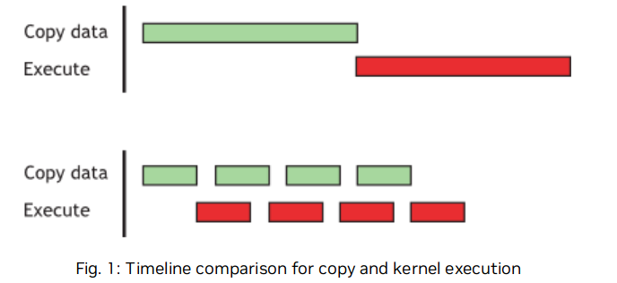

# Chapter 12 性能度量 Performance Metrics

## 12.1 计时器
在对CUDA程序计时时，使用CPU或者GPU的计时器都是可以的，下面是对这两种计时方法的分析：
### 12.1.1 使用CPU计时器

使用传统的基于CPU的计时器比如<chrono>等，但是在GPU上函数的执行是异步的，所以为了精确地测量调用CUDA函数的耗时，需要在启动和停止计时器时先试用cudaDeviceSynchronize()强制对CPU和GPU进行同步，cudaDeviceSynchronize()将调用的CPU线程堵塞，直到完成所有CUDA的操作。
虽然在GPU上也可以将CPU线程与特定的流或事件进行同步，但是这些同步函数并不适用于默认流以外的流中的计时器，cudaStreamSynchronize ( )将CPU线程阻塞，直到之前发送到给定流中的所有CUDA调用都完成。cudaEventSynchronize ( )阻塞，直到特定流中的给定事件被GPU记录。由于驱动程序可能会交织执行来自其他非默认流的CUDA调用，因此可能会将其他流中的调用包含在计时中。但是默认流Stream0在device上工作表现出串行性，所以可以直接使用这些函数进行计时。
最后需要注意一点的是，CPU和GPU的同步操作会强制阻塞，所以会最大限度的降低性能。
### 12.1.2 使用GPU计时器

```cpp
cudaEvent_t start, stop; 
float time; 
cudaEventCreate(&start); 
cudaEventCreate(&stop); 
cudaEventRecord( start, 0 );  // 这里的0是指 Stream0，也就是默认流
kernel<<<grid,threads>>> ( d_odata, d_idata, size_x, size_y, NUM_REPS); 
cudaEventRecord( stop, 0 );  // 同样这里也是
cudaEventSynchronize( stop ); 
cudaEventElapsedTime( &time, start, stop ); 
cudaEventDestroy( start ); 
cudaEventDestroy( stop );

```
使用cudaEventRecord将start 和 stop这两个事件放入到Stream0中，当事件到达Stream0时，会记录时间戳，使用cudaEventSynchronize对CPU和GPU进行同步，然后使用cudaEventElapsedTime进行计时。这种计时时使用GPU时钟进行计时的，

## 12.2 带宽 (Band Width) **Hight Priority**

带宽衡量数据的传输速率，在性能优化中是很重要的一环，为了准确测量性能，需要计算理论带宽和有效带宽。当后者远低于前者时，设计或实现细节都有可能降低带宽，提高带宽应该是后续优化工作的首要目标。

### 12.2.1 理论带宽计算

可以根据显卡的硬件规格参数进行计算。
例如，NVIDIA Tesla V100采用HBM2 (双倍数据率) RAM，其存储时钟速率为877 MHz，具有4096位宽的存储器接口。
$$(0.877 \times 10^9 \times 4096/8 \times 2) \div 10^9 = 898GB/s$$
### 12.2.2 有效带宽计算

有效带宽用于了解在程序运行过程中数据数如何访问的，下面是计算公式
$$Effective Band Width = ((Byte_{read} + Byte_{write}) \div 10^9) \div times$$
(通常使用GB/s作为单位)
这里Byte_read 和Byte_wirte分别是在kernel中读取和写入的字节数。
例如，计算一个对$2048 \times 2048$的矩阵进行拷贝的操作的带宽：
$$((2048 ^ 2 \div 4 \times 2) \div 10^9) \div time$$
这里的4是float类型的字节，2是包含了读写两次操作。

### 12.2.3 Visual Profiler
使用Visual Profiler可以查看一下几个吞吐量指标：
- Requested Global Load Throughput  
- Requested Global Store Throughput
- Global Load Throughput 
- Global Store Throughput 
- DRAM Read Throughput 
- DRAM Write Throughput

其中 Requested Global Load Throughput 和 Request Global Store Throughput表示的是kernel中的全局内存吞吐量，用于计算Effective Band Width有用。
而在程序运行过程中整体的吞吐量还会计算一些不会使用的数据传输，也就是Global Load Throughput 和 Global Load Throughput。
这两者的比较可以有效的看出Global Memory被浪费了多少资源，对于Global Memory访问，这种请求的内存带宽与实际的内存带宽的比较是通过Global Memory Load Efficiency和Global Memory Store Efficiency的度量来报告的。


# Chapter13 内存优化 Memory Optimizations 

内存优化是性能优化中最重要的领域。其目标是通过最大化带宽来最大化硬件的使用。带宽是通过使用尽可能多的快速存储器和尽可能少的慢速存储器来实现的。本章讨论了主机和设备上的各种内存，以及如何更好地设置数据项来有效地使用内存。

## 13.1 Host的Device的数据传输

关于Host和Device的数据传输，看看这篇blog，感觉很不错[Nvidia Blog](herf=https://developer.nvidia.com/blog/how-optimize-data-transfers-cuda-cc/)。

首先，device memory和GPU之间的带宽（上文中提到的V100 898GB/s）远高于host memory和device memory之间的带宽（16GB/s  pcie x16 Gen3）。

### 13.1.1 Pinned Memory (锁页内存)

一般情况下GPU不能直接访问主机内存中的数据，在进行数据传输的时候，需要先在主机上分配一个临时的page-locked memory(pinned memory)， 然后将主机的数据copy到这块区域内，然后再将这块区域内的数据transfer到设备上。


如上图所示，在左图中，发生了两次拷贝，我们可以完全避免这次拷贝，然后直接使用cudaHostAlloc() / cudaMallocHost() 直接申请这片pinned memory并避免了一次拷贝。在进行数据传输的时候，仍然可以使用cudaMemcpy()进行数据拷贝。
合理使用pinned memory可以有效的提高数据传输的带宽，但是过度的使用，会造成性能的下降，因为它减少了操作系统和其他程序的内存可使用量。

### 13.1.2 通过Stream来并发数据传输

#### 13.1.2.1 并发Device数据传输和Host计算
在使用cudaMemcpy()的时候，会强制进行阻塞，也就是说，当数据传输完成后才会将控制权返回给主机，ercudaMemcpyAsync()是非阻塞的，控制权立即返回给主机，在调用时额外多了一个参数 stream id。流就是在gpu执行的所有操作的载体，包括数据传输、kernel等。

```cpp
// Overlapping computation and data transfers
cudaMemcpyAsync(a_d, a_h, size, cudaMemcpyHostToDevice, 0); //异步传输数据，并且不阻塞主机， by stream0
kernel<<<grid, block>>>(a_d); // 启动kernel by default stream 0
cpuFunction();                // 执行主机计算
```

这里使用的是都是stream 0同一个流，在流内部保证操作按顺序进行， 所以这里会在数据拷贝完成后进行kernel中的计算，不需要显示的进行同步。通过这个例子可以将数据传输和主机的计算并行起来。
#### 13.1.2.1 并发Device数据拷贝和Device kernel execute

在上面的例子中拷贝数据和启动kernel本身就是需要顺序去执行的，同时还可以并行数据传输和kernel的执行，这种特性可以通过cudaDeviceProp().asynEngineCount来查询。通过设置不同的stream id就可以让数据传输和kernel的执行并发的去执行，但是这里需要**注意**的一点是，此时，这里不能使用default stream(Stream 0)，由于默认流本身具有一定的特性：在设备上其他流的工作没完成之前，默认流的工作不会开始，同时默认流的工作没结束之前，其他新的流的工作也不能开始。

通过这种特性，就可以将一些大块的、可进行划分的数据划分为几个部分，然后分开去进行数据传输和kernel的执行，达到并发的效果。


```cpp
size=N*sizeof(float)∕nStreams; 
for (i=0; i<nStreams; i++) { 
    offset = i*N∕nStreams; cudaMemcpyAsync(a_d+offset, a_h+offset, size, dir, stream[i]); 
    kernel<<<N∕(nThreads*nStreams), nThreads, 0, stream[i]>>>(a_d+offset); 
}
```



以上是overlapping之后的效果。

### 13.1.3 零拷贝 (Zero copy)

Zero copy使得GPU可以直接访问主机的内存，

```cpp
float *a_h, *a_map; 
... 
cudaGetDeviceProperties(&prop, 0); 
if (!prop.canMapHostMemory) 
    exit(0); 
cudaSetDeviceFlags(cudaDeviceMapHost); 
cudaHostAlloc(&a_h, nBytes, cudaHostAllocMapped); cudaHostGetDevicePointer(&a_map, a_h, 0); 
kernel<<<gridSize, blockSize>>>(a_map);

```
零拷贝避免了使用stream进行传输，GPU在运行时，直接访问的是主机中的内存区域。

### 13.1.4 Unified Virtual Address(UVA) 统一虚拟寻址
主机和设备可以共享同一个虚拟地址。


### 讨论： 关于使用pinned memory,not mapped (页锁内存)和mapped，pinned memory(Zero copy)的情况区别：

 [stackoverflow上的讨论](https://stackoverflow.com/questions/5209214/default-pinned-memory-vs-zero-copy-memory)
简单概括下高赞回答：
- Zero copy：
  - GPU本身没有内存了，只能使用RAM。
  - 只加载一次数据，但是需要对其执行大量的计算，并且隐藏内存传输延迟。
  - 数据并不适合GPU。
- pinned memory：
  - 当您多次加载或存储数据时。例如：您有多个后续内核，分步执行工作 - 无需每次都从主机加载数据。
  - 没有太多的计算需要执行，并且加载延迟不会被很好地隐藏

## 13.2 Device Memory 设备内存

设备内存中有不同的部分，每一部分都为了特定的功能而设计的。


不同的内存访问延迟：Global > local > texture > constant > shared > register 


