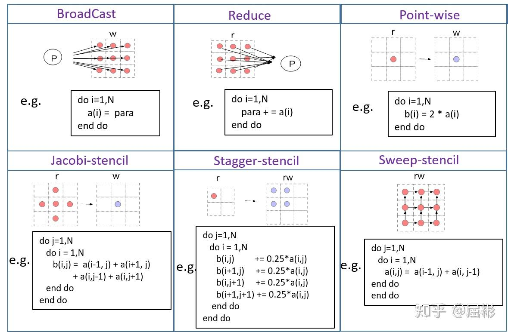

# 第一章 Introduction

# 第二章 Heterogeneous data parallel computing

# 第三章 Multidimensional grids and data

# 第四章 Compute architecture and scheduling

# 第五章 Mememory architecture and data locality

# 第六章 Performance Considerations

## 6.1 Memory coalescing 合并访存

## 6.2 Hiding memory latency 隐藏内存延迟

## 6.3 Thread coarsing 线程粗化

## 6.4 内存优化清单

## 6.5 了解计算得瓶颈

## 6.6 总结

# 第8章 Stencil 模板计算

模板（Stencil）计算是数值模拟程序中常见的循环运算模式，其特点是遍历计算区域，每个位置均执行相同的计算操作。

在本章中，我们将重点介绍将模板应用于所有相关输入网格点以生成所有网格点的输出值的计算模式，这称为**模板扫描**。

## basic parallelizing 

