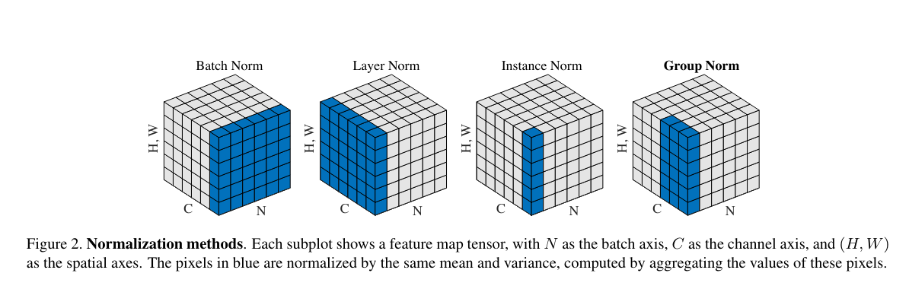
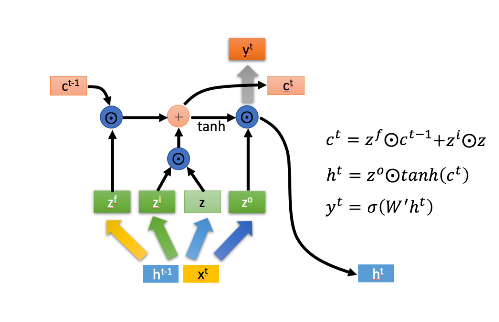
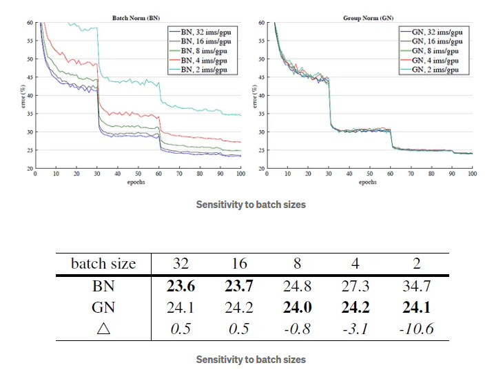

# Normalization 归一化




## Batch Normal

[Batch Norm Paper](http://arxiv.org/abs/1502.03167) 

神经网络是通过很多层的神经元搭建起来的，每一次的输入都受到前面所有层的参数的影响，因此训练变得会很复杂，随着网络变得更深，网络参数微小的变换会被放大。由于每一层网络的输入分布的不同，后面的层需要不断的去适应新的分布这就是$covariate  \,shift$（内部协变量偏移）。这样就会导致学习不稳定，收敛速度慢，容易掉进激活函数的饱和区。但是如果直接对每一层的输出都归一化为标准正态分布就会导致网络完全学习不到输入数据的特征。因此BatchNormalization就在特征的每一个维度上进行归一化处理，即对于d-dimentional的特征 

$$
x = (x^{(1)},...,x^{(d)})
$$

，将会对其中每一维进行归一化处理:

$$
\hat{x}^{(k)} = \frac{x^{(k)}-E[x^{(k)}]}{\sqrt{Var[x^{(k)}]}}
$$

其中均值和方差都是根据样本来计算得到的，下面是BatchNormalization的具体过程(正向传播过程)：


下面推导一下反向传播的过程：

对于多元函数的链式求导法则:

$$
g(f(x, y), h(x,y))
$$

对于x的偏导数为:

$$
\frac{\partial g}{\partial x} = \frac{\partial g}{\partial f}*\frac{\partial f}{\partial x} 
+ \frac{\partial g}{\partial h}*\frac{\partial h}{\partial x}
$$

首先对于$\hat{x_i},\gamma , \beta$的导数比较简单：

$$
\frac{\partial \ell }{\partial \gamma} = \frac{\partial \ell }{\partial y_i}*\sum_{i=0}^m\hat{x_i} \\
\frac{\partial \ell }{\partial \beta} = \frac{\partial \ell }{\partial y_i}*\sum_{i=0}^m \\
\frac{\partial \ell }{\partial \hat{x_i}} = \gamma    
$$

然后是对$\sigma^2_{\mathcal{B}}$的导数:

$$
\frac{\partial \ell }{\partial \sigma^2_{\mathcal{B}}} = \sum_{i=0}^m \frac{\partial \ell }{\partial \hat{x_i}} *
-\frac{1}{2}(x_i - \mu_{\mathcal{B}})*(\sigma^2_{\mathcal{B}} + \varepsilon)^{-\frac{3}{2}}
$$

接下来是对$\mu_{\mathcal{B}}$的求导，这里要用到多元函数链式求导法则，其中$\sigma^2_{\mathcal{B}}$是$\mu_{\mathcal{B}}$的函数:

$$
\frac{\partial \ell}{\partial \mu_{\mathcal{B}}} =  
\frac{\partial \ell}{\partial \hat{x_i}}*\sum_{i = 0}^{m}-\frac{1}{\sqrt{\sigma^2_{\mathcal{B}} + \varepsilon}}
+
\frac{\partial \ell}{\partial \sigma^2_{\mathcal{B}}}*\frac{\sum_{i=0}^m-2(x_i - \mu_{\mathcal{B}})}{m}
$$

同样还有关于$x_i$的导数，其中在$\hat{x_i}$的式子里，$x_i, \mu_{\mathcal{B}}, \sigma^2_{\mathcal{B}}$都是与$x_i$相关的函数：

$$
\frac{\partial \ell}{\partial x_i} = 
\frac{\partial \ell}{\partial \hat{x_i}}*(\sigma^2_{\mathcal{B}} + \varepsilon)^{-\frac{1}{2}}
+
\frac{\partial \ell}{\partial \sigma^2_{\mathcal{B}}}*\frac{1}{m}\sum_{i=0}^m2(x_i-\mu_{\mathcal{B}})
+
\frac{\partial \ell}{\partial \mu_{\mathcal{B}}}*\frac{1}{m}
$$

BN模块满足$y_i = BN(x_i, \sigma, \mu, \gamma, \beta)$，其中$\gamma, \beta$都是通过训练得到的值，$\sigma, \mu$都是通过数据集中得到的，在推理过程中$\sigma, \mu$就必须使用训练过程中动态维护的均值和方差，均值即为各个Batch均值的均值，方差为各个batch方差均值的修正，对应的BN模块的计算过程变为：

$$
E[x] = E_{\mathcal{B}}[\mu_\mathcal{B}] \\
Var[x] = \frac{m}{m - 1}E_{\mathcal{B}}[\sigma^2_\mathcal{B}] \\
y = \frac{\gamma}{\sqrt{Var[x] + \varepsilon}}*x + (\beta - \frac{\gamma E[x]}{\sqrt{Var[x] + \varepsilon}})
$$

优点：

   1. 加速神经网络的训练，避免梯度跌入饱和区。

缺点：

1. 对batchsize的大小很敏感，太小的batchsize表现不好，太小的batchsize不能很好的表现出样本的方差和均值。

## Layer Normal
[Layer Norm Paper](https://arxiv.org/abs/1607.06450)

LayerNormalization和BatchNoralization不同的是BN是在一个batch上对特征的每一维去做归一化，而LN是在当前层上去做归一化处理，这种处理方式克服了BN不能在RNN上使用的缺陷。下面给出LN的具体公式：

$$
LN(z;\alpha, \beta) = \frac{(z - \mu)}{\sigma}\odot\alpha + \beta, \\
\mu = \frac{1}{D}\sum_{i = 1}^Dz_i, \, \sigma^2 = \frac{1}{D}\sum(z_i - \mu)^2, \\
其中，z_i是输入向量的第i个,D表示这个向量的维度
$$

这也可能会导致一定的问题，如果这些特征向量是有实际的物理含义比如颜色和高度等，直接对这一层的输入进行这种归一化是会抹平特征导致信息损失，导致模型的表达能力降低。所以在NLP领域中更合适。

例如下面是一个RNN Unit：



其中$c^{t - 1},h^{t-1}$是上一个时刻传递下来的 cell state和 hidden state，z是根据$h^{t-1}$和$x^{t}$矩阵相乘然后拆分开的。
$$
\begin{pmatrix}
 z^f\\
 z^i\\
 z\\
 z^o
\end{pmatrix} = W_hh^{t-1} + W_xx^t +b \\
c^t = \sigma(z^f)\odot c^{t-1}+\sigma(z^i)\odot \tanh(z) \\
h^t = \sigma \odot \tanh(c^t)
$$
把LN加入到LSTM之后的公式为:
$$
\begin{pmatrix}
 z^f\\
 z^i\\
 z\\
 z^o
\end{pmatrix} = LN(W_hh^{t-1};\alpha_1,\beta_1) + LN(W_xx^t;\alpha_2,\beta_2)  +b\\
c^t = \sigma(z^f)\odot c^{t-1}+\sigma(z^i)\odot \tanh(z) \\
h^t = \sigma \odot \tanh(LN(c^t;\alpha_3, \beta_3))
$$

其反向传播的推导过程和BN的推导过程基本一致。

## Instance Normal

[Instance Norm Paper](http://arxiv.org/abs/1607.08022)

实例归一化也叫对比度归一化，是在风格迁移领域中提出来。其优化的函数是：
$$
\underset{g}{\min}\frac{1}{n}\sum_{t=1}^{n}\zeta(x_0,x_t,g(x_0,x_t)) \\
其中g(x_0,x_t)为生成器
$$
风格迁移是将输入$X_0$中的内容迁移到$x_t$中，其本质是使得$x_t$和$x_0$的对比度相似，所以生成器中的loss项应该更关注于对比度上的差异，而丢弃$x_t$中的对比度。所以对于一批$T$的数据来说，$x\in\mathbb{R}^{T\times C \times W \times H}$是图像中的一个像素，下面是IN的计算公式：
$$
\mu_i = \frac{1}{HWT}\sum_{t=1}^T\sum_{l=1}^W\sum_{m=1}^Hx_{tilm} \\
\sigma^2 = \frac{1}{HWT}\sum_{t=1}^T\sum_{l=1}^W\sum_{m=1}^H(x_{tilm} - \mu_i)^2 \\
y_{tijk} = \frac{x_{tijk} - \mu_i}{\sqrt{\sigma^2+\varepsilon}} \\
$$

## Gourp Norm
[Group Norm Paper](https://arxiv.org/pdf/1803.08494) 

group norm对数据划分成不同的group 然后再去做归一化。在论文的实验中可以看出来，GN在大部分情况的表现是没有BN好，但是由于BN对batchsize非常敏感，但是GN很平稳。在batchsize为 2 的情况下，GN 的错误率比 BN 低 10.6%（24.1% vs. 34.7%）。



下面是通过pytorch实现的GroupNorm

```python
import torch
import torch.nn as nn
class GroupNorm(nn.Module):

    def __init__(self, c_num, group_num=36, eps=1e-10)
    # x is input features with shape [N, C, H, W] batchsize， 通道数， 高， 宽
    # c_num 为通道数
    # gamma, beta 分别是 放缩系数和偏移量，其形状为[1, C, 1, 1]
    # G 为分的组的大小  
        super(GroupNorm,self).__init__()
        self.group_num = group_num
        self.gamma = nn.Parameter(torch.ones(c_num, 1, 1))
        self.beta = nn.Parameter(torch.zeros(c_num, 1, 1))
        self.eps = eps
    def forward(self, x)
        
        N, C, H, W = x.shape()
        x = x.view(N, self.group_num, -1)
        mean = x.mean(dim = 2, keepdim = True)
        std = x.std(dim = 2, keepdim = True)

        x = (x - mean) / (std+self.eps)
        x = x.view(N, C, H, W)

        return x * self.gamma + self.beta
```


## Final

我的理解：

归一化是为了消除内部协变量偏移，如量纲引起的数值上的差异。同时，同时还要兼顾不同任务中的目的，不能通过归一化将与任务相关的一些特征的差异擦除，比如BN，LN和IN这三种不同的归一化方法适用于不同的任务。归一化是优化数值从而使得在梯度下降的过程中易于去优化从而提升训练的效率。

参考博客：

[Normalization Technique总结](https://yiyele.blog.csdn.net/article/details/81460553?spm=1001.2101.3001.6650.2&utm_medium=distribute.pc_relevant.none-task-blog-2%7Edefault%7EBlogCommendFromBaidu%7ERate-2-81460553-blog-99995392.235%5Ev43%5Epc_blog_bottom_relevance_base6&depth_1-utm_source=distribute.pc_relevant.none-task-blog-2%7Edefault%7EBlogCommendFromBaidu%7ERate-2-81460553-blog-99995392.235%5Ev43%5Epc_blog_bottom_relevance_base6&utm_relevant_index=3)

[Review — Group Norm (GN): Group Normalization](https://sh-tsang.medium.com/review-group-norm-gn-group-normalization-image-classification-5f7fe0f58eb6)

